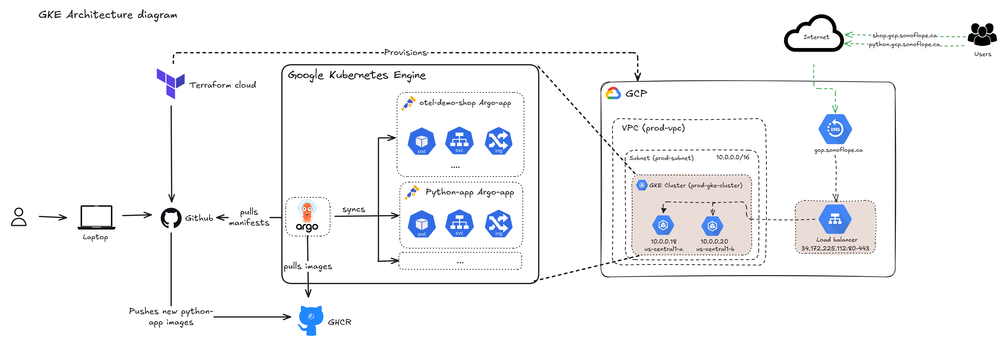
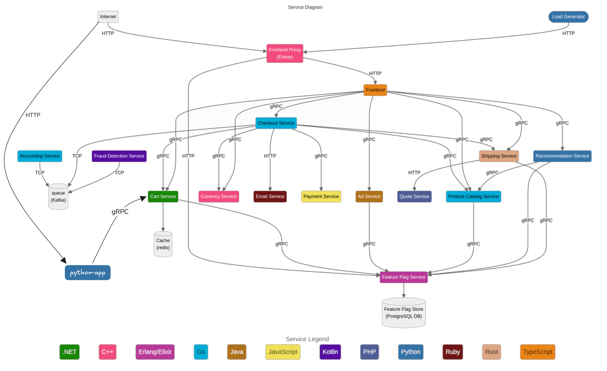
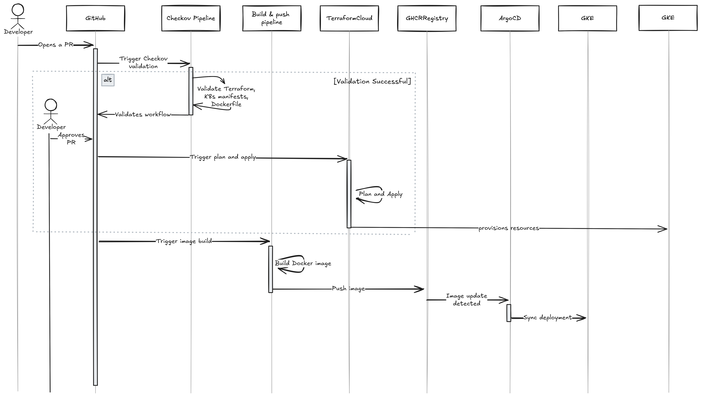
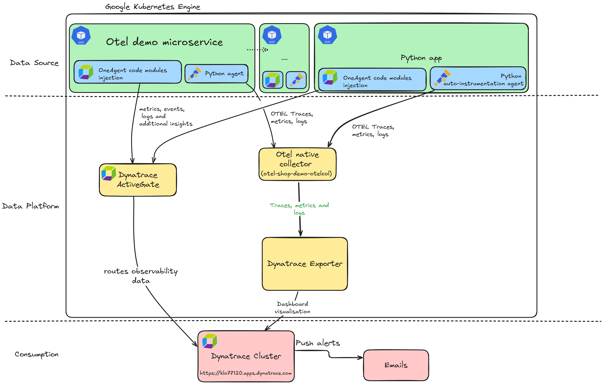

# Infrastructure for the project

This project is a simple example of creating a GKE cluster using Terraform to
manage the infrastructure. The project is divided into the following sections:

- Terraform : The folder `terraform` contains the code to create the GKE
cluster, a DNS zone and a VPC network. The state file is stored in Terraform
Cloud.
- gke : The folder `gke` contains the Kubernetes manifests to deploy the
different services in the cluster. ArgoCD is used to sync the manifests with the
cluster.

The following diagram shows the architecture of the resources provisioned :

- [OpenTelemetry Astronomy Shop
  Demo](https://github.com/open-telemetry/opentelemetry-demo) : A deployment of
the OpenTelemetry Astronomy Shop Demo is included in the Kubernetes manifests to
showcase instrumentation with OpenTelemetry.

The following diagram shows the architecture of the otel demo app:

- Python app : The folder `python-app` contains a simple flask app that can
query the OpenTelemetry cart service to retrieve the cart items of a user. This
app is used to demonstrate auto-instrumentation and the deployment pipeline.

The following diagram shows the CICD pipeline for the python app:

- Dynatrace integration : The Dynatrace operator is deployed in the cluster to
  provide monitoring and observability.

The following diagram shows the architecture of the instrumentation workflow
for the project:

